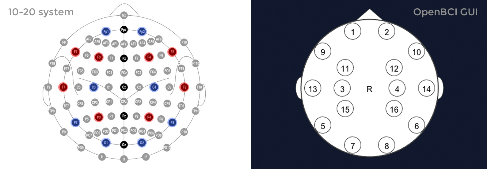

# Occipital Region Study (OpenBCI)

The aim of this document is to describe how sensors are relocated in Open BCI helmet,
from 10-20 system to custom locations.
It is done in order to get more readings/data from an occipital region of the brain.

## Sensor relocation

#### Original locations:

If the assembly of OpenBCI Ultracortex Mk4 helmet was done following this [guide](https://docs.openbci.com/AddOns/Headwear/MarkIV/) then the helmet should have electrodes located in 10-20 system
(assuming 16-channel version was assembled):



When streamed with LSL protocol, the streamed data has the following order:
```
['fp1','fp2','c3','c4','p7','p8','o1','o2','f7','f8','f3','f4','t7','t8','p3','p4']
```

It is important since we will be moving sensors and will have to 'relabel' channels.

#### Relocating sensors:

The new location of the sensors will be moved as follows:

| Original |    | New | Ch No. |
|:--------:|:--:|:---:|:------:|
|    T8    | -> | Oz  |   14   |
|    C4    | -> | Po4 |   4    |
|    C3    | -> | Po3 |   3    |
|    T7    | -> | Pz  |   13   |

 As a result, three additional electrodes placed on the occipital region and one more near the region (Pz).14

 When streamed with LSL protocol, the streamed data has the following order:
```
['fp1','fp2','po3','po4','p7','p8','o1','o2','f7','f8','f3','f4','Pz','Oz','p3','p4']
```
The indexes(0-based) of channels in the occipital region or near it:
```
[2,3,4,5,6,7,12,13,14,15]
```

### Testing relocation

Testing can be done with [OpenBCI GUI Impedance Test](https://docs.openbci.com/Software/OpenBCISoftware/GUIDocs/#impedance-testing)