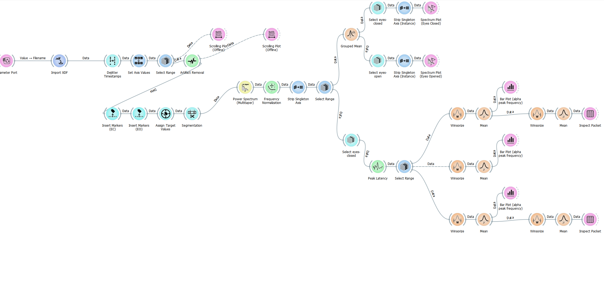
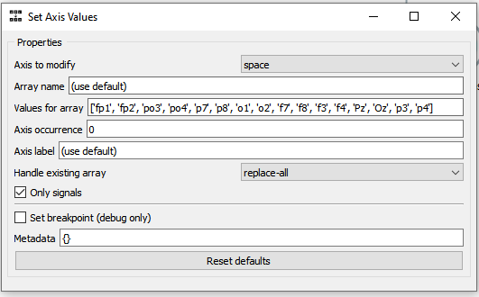
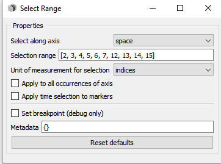
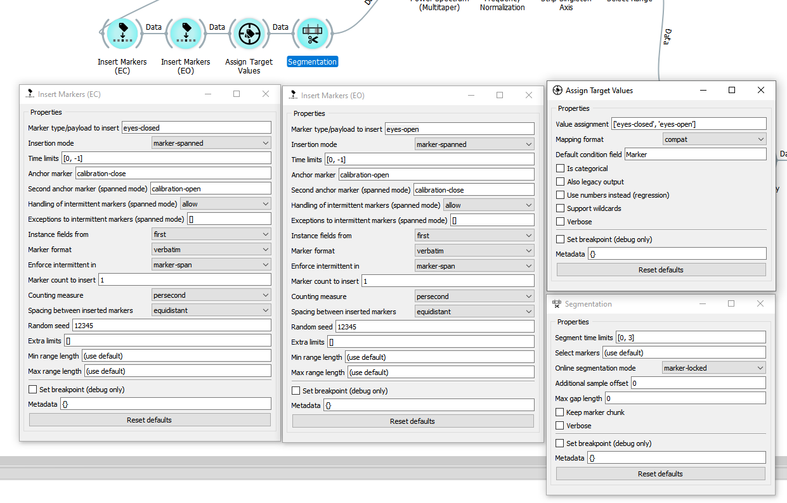

BCI study: Alpha Waves
===

### Contents

1. [Description](#description)
2. [Experiment](#experiment)
    - [Setup](#setup)
    - [Follow experiment](#follow-experiment)
      - [OpenBCI GUI](#openbci-gui)
      - [Experiment recorder](#experiment-recorder)
      - [Neuropype Pipelines](#neuropype-pypelines)
      - [Control RC tank](#control-rc-tank)
3. [Pypelines](#pypelines)

Description
---

This readme describes experiment setup, how to follow through and explanation on individual parts in the experiment. 
Note that licensed software is used, although it is free for academic use.

Experiment
---

### Setup
For the experiment following is needed:

- Assembled Ultracortex Mark 4 helmet
- OpenBCI GUI
- Neuropype
- Experiment recorder (Included in Neuropype)
- Python and IDE

Ultracortex Mark 4 helmet:

In order to achieve follow this experiment, the position of the sensors in the helmet has to be changed.
It is done in order to get better readings from the occipital region of the brain.
Guide to change position of the sensors can be found [here](../bci-occipital-sensor-reposition/README.md).

Experiment recorder setup:
- Go to root folder where Experiment Recorder is installed
- Put all media files in `src/media` folder.
- Put `alpha_waves_calibration_study.er` in `settings/custom`
- Put `alpha_waves_calibration.cfg` in `configs/custom`
- Put `alpha_waves_calibration.py` in `src/modules`

### Follow experiment

The experiment is divided in three parts:
- Collect data about individuals alpha-waves
- Analyze data, estimate parameters
- Using estimated parameters, detect alpha-waves
- Control robot

#### OpenBCI GUI

Open OpenBCI GUI. Connect helmet, 16 channels. Choose widgets: Time Series, Packet Loss, Networking.

Time Series is the data transmitted to Experiment Recorder later on.

Packet Loss is needed to monitor packet loss during experiment.
If the connection is unstable and a lot of data is lost, experiment should be started from the beginning.

Networking, choose LSL protocol.
In Stream 1 choose `TimeSeries` to transmit.
Name of the stream should be `obci_eeg1`, type EEG.
__Note that transmitted stream should be filtered in OpenBCI GUI!__
Pypelines used later in Neuropype will not perform basic FIR filtering and assume it is done at this stage.

#### Experiment recorder

Open `alpha_waves_calibration_study.er` with Experiment recorder included in Neuropype.
Connect to the stream from OpenBCI GUI.
Start experiment (it should be only one listed if `.er` file was used).

Note, for better data analysis later it is best to gather data for ~45 seconds during instruction phase.
As these 45 seconds will be later used in the pypelines to filter signals. 
Also, during the `open` phase of experiment it is better to make subject watch some semi-transparent video, 
without any flashy content.

#### Neuropype pypelines

In `pypelines` folder yoy can find 4 `.pyp` files.
They can be opened in Pipeline Designer.
Even though they can be run on the server, this guide assumes you
run them on in designer since plots are the main source for analyzing experiment data.

After recording data into `.xdf` file you can open `1_AlphaWavesOfflineReview.pyp` to review whole recoding
as if it is 'online' and enable/disable plots as needed. 
This pypeline is mostly for a revision.

__Note:__ For the file name use the full path, file name should be inserted as raw 
python string - `r'filename'` or `r"filename"`

Next is `2_AlphaWavesOfflineFrequencyRange.pyp` this one is important to run to see if there is any artifacts/noise 
in frequency plot and the pypeline will also give the 'range' of alpha waves for the person.
Note that given range from pypeline might be far from optimal and ultimately should be judged 
by the experimenter using spectrum plots.
Usually, though, it is 8-12 Hz range.

After using previous pypeline to analyze average spectrum plots and define alpha-waves frequency range you can
run  `4_AlphaWavesOnlineWakefulRelaxationResult.pyp`. 
This pypeline is supposed to work on streamed data. 
It takes `obci_eeg1` stream, runs it through pypeline and outputs result to LSL stram again as 0.0–1.0 value.
Bigger value means more neurons are synchronized and produce EEG signals in 8-12 Hz, alpha waves.

Pypeline under name `3_AlphaWavesOfflineWakefulRelaxationReview.pyp` allows you to run `xdf` recording and 
have the same result/output as if running `4_AlphaWavesOnlineWakefulRelaxationResult.pyp`, just without 
feeding live data to Neuropype and just using a recording file.

#### Control RC tank

To control RC tank you need to do these steps:

- Turn on helmet (PC mode), input the dongle from cyton board to usb
- Open BCI GUI
- Start 16 channels
- Select widgets - EEG, FFT, NETWORKING
- Start LSL streams (Protocol LSL, TimeSeriesFilt)
- Put helmet on head
- Turn on RC tank (power and motor switch) -> HC-06 model should blink
- Turn on bluetooth  -> connect to HC-06 (password is 1234)
    - If it already 'paired' -> remove device and pair again
- Run [4_AlphaWavesOnlineWakefulRelaxationResult.pyp](./pypelines/4_AlphaWavesOnlineWakefulRelaxationResult.pyp) pypeline
- Run [bci_bl_control_alpha_study.py](../simple-control/src/bci_bl_control/bci_bl_control_alpha_study.py) -> choose correct COM port
- Lower treshold values if you need [(sample_result[0] > 0.8 (40th line))](../simple-control/src/bci_bl_control/bci_bl_control_alpha_study.py) 

That's all, you are running an experiment now.

### Pypelines

This section provides more description about pypelines themselves.
More about pypelines and designer can be found in [Neuropype documentation](https://www.neuropype.io/docs/).

Here below it the screenshot from Pipeline Designer of `2_AlphaWavesOfflineFrequencyRange.pyp`:

1. We import XDF file and 'restream' it.
2. Do the dejitttering.
3. Set values of channels to match 10-20 system.\
This part is important that it sets readable labels for channels, more so if the positions of the sensors were changed:
\
Also only channels/electrodes on the back of the head (occipital region) is chosen:\

4. Standard artifact removal (will shave off ~45s)
5. The next step is segmentation. The purpose of these four nodes is to:
    - Insert marker `eyes-closed` and `eyes-open` in even interval of 1 second 
    - Inserted between EC and EO separately
    - Assign them as targets
    - Cut at each marker and 3 seconds after

6. Cut segments are pyped into spectrum.
7. Calculate grouped means. Group by column `Marker`.
8. Show average spectrum plots (eyes closed and eyes opened).
9. Next select only spectrums (the ones which are average over 3 seconds) where eyes closed.
10. Find peak frequency in each of them
11. Using winsorizing select first 25%, middle 25%, and last 25%
12. Using winsorizing again find mean of low 25% and high 25%
13. Display them as 'range' of alpha waves

