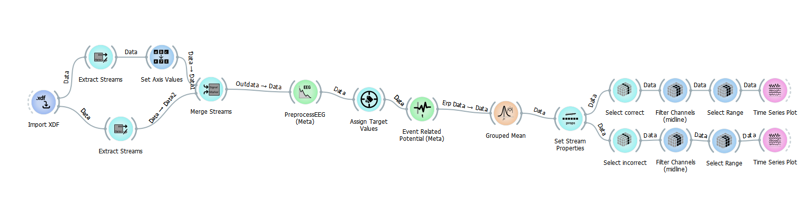
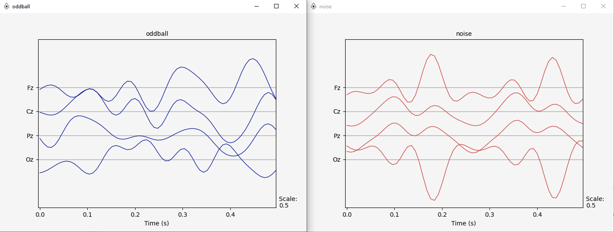
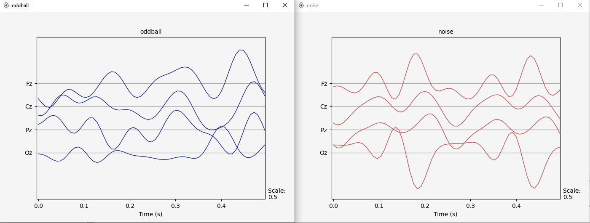
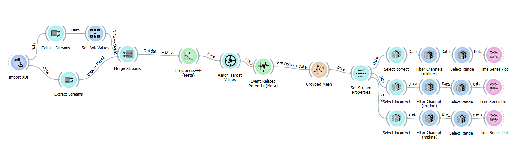
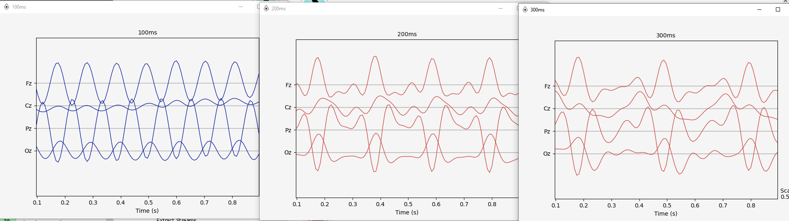
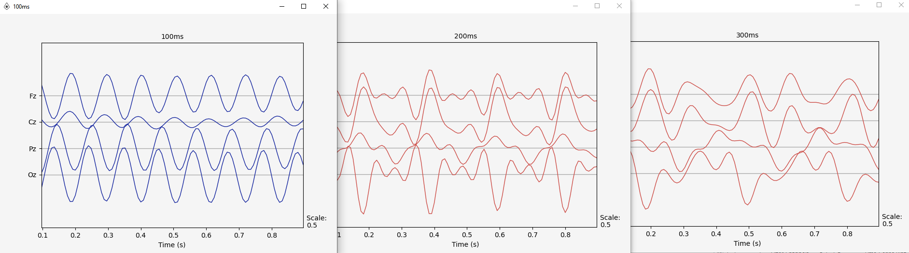

BCI study: P300 (Part 1)
===

### Contents

1. [Description](#description)
2. [Experiment](#experiment)
    - [Setup](#setup)
    - [Follow experiment](#follow-experiment)
    - [OpenBCI GUI](#openbci-gui)
    - [Experiment Recorder](#experiment-recorder)
        - [P300 first experiment](#p300-first-experiment)
        - [P300 first experiment results](#p300-first-experiment-results)
        - [P300 second experiment](#p300-second-experiment)
        - [P300 second experiment results](#p300-second-experiment-results)

Description
---

This readme describes experiment setup, how to follow through and explanation on individual parts in the experiment. 
Note that licensed software is used, although it is free for academic use.

Experiment
---

### Setup

The set up proccess is well described in [Alpha wawes bci study](../bci-study-alpha-waves/README.md#setup). The only difference is other [sensors placement](../bci-p300-sensors-reposition/README.md).

Experiment recorder setup:
- Go to root folder where Experiment Recorder is installed
- Put `pics` folder in `src/media` folder.
- Put `p300.er` and `p300_2.er` in `settings/custom`
- Put `p300.cfg` and `p300_2.cfg` in `configs/custom`
- Put `p300.py` and `p300_2.py` in `src/modules`

### Follow experiment

Right now there is only one part of an experiment, in the future more parts will be added.
- Studying P300 and collecting information
- WIP...

### OpenBCI GUI

Open bci section well described in [Alpha wawes bci study](../bci-study-alpha-waves/README.md#openbci-gui)

__Note that transmitted stream should be unfiltered in OpenBCI GUI!__

### Experiment Recorder

#### P300 first experiment

Configure [`p300.cfg`](./experiment_recorder/p300/p300.cfg) before starting experiment for your needs. Open Experiment Recorder  __as administrator__(important), open `Settings` and click `Load .er settings`, and load [`p300.er`](./experiment_recorder/p300/p300.er). 

Connect to the stream from OpenBCI GUI.

Start experiment. You'll need to focus on the noises and count red squares. Try not to move your head and not to clip your eyes during the experiment.

#### P300 first experiment results

Go to folder where you saved `xdf` file. Open [`p_300.pyp`](./pypelines/p300.pyp), paste path to the xdf file into `Import XDF` node, run pipelines.

__If you are not able to record your example data you can use our example data.__

We've got these results recorded on one subject:

As we noticed noise graph has more constant pattern than an oddball one, so next experiment we decided to focus more on noises and frequencies.

#### P300 second experiment

Open [`p300_2.er`](./experiment_recorder/p300_2/p300_2.er) with Experiment Recorder.

Connect to the stream from OpenBCI GUI.

Start experiment. You'll need to focus on the noises there will be couple of blocks and noises will have different frequency each block. Try not to move your head and not to clip your eyes during the experiment.

#### P300 second experiment results

Open [`p300_2.xdf`](./pypelines/p300.pyp). Paste path to your xdf file into `Import XDF` node. 

__Note that if you changed [`p300_2.cfg`](./experiment_recorder/p300_2/p300_2.cfg) you'll need to change `Assign Target Values` node and etc.__

Here is our results:

We can see constant patterns on these ones. Even though these results are from two different subjects.

WIP...
